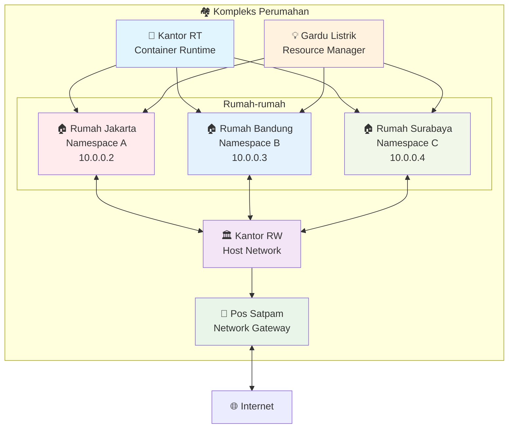
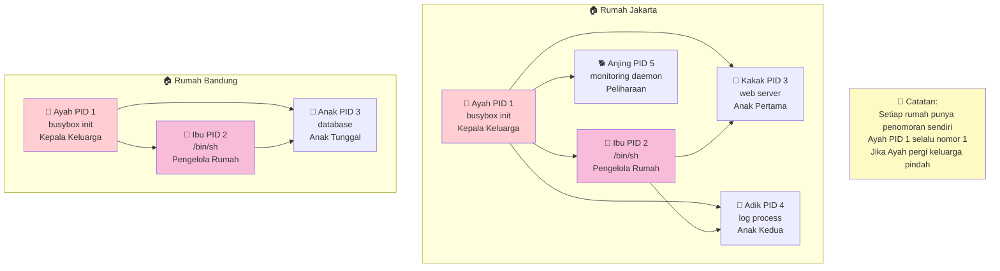
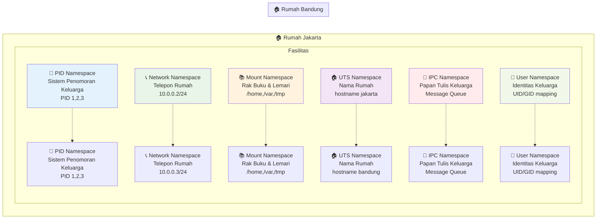
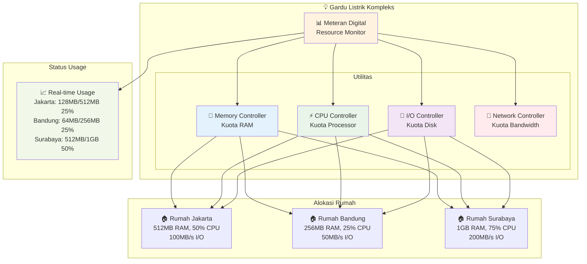
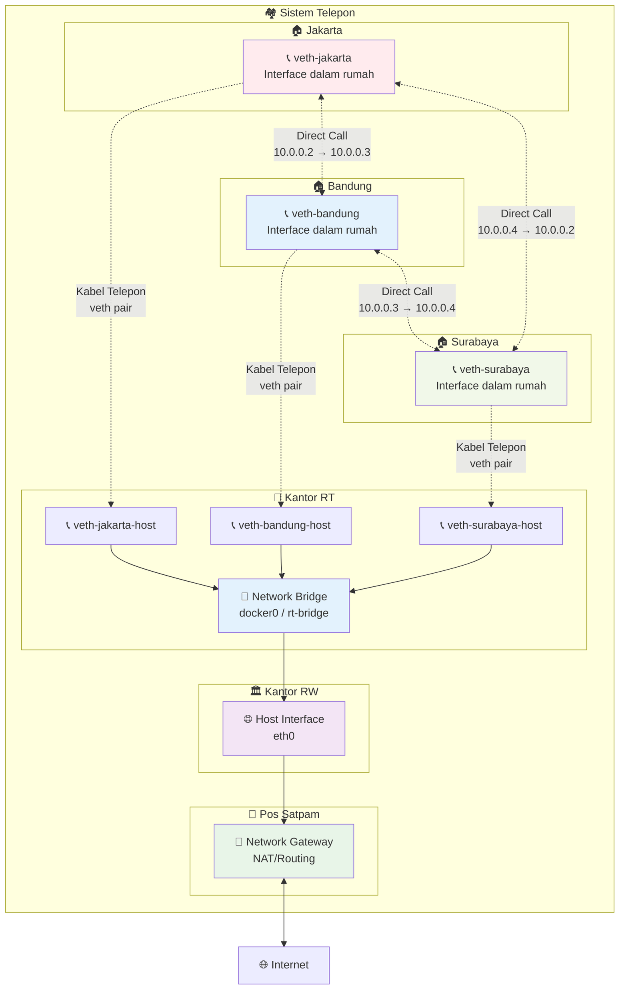
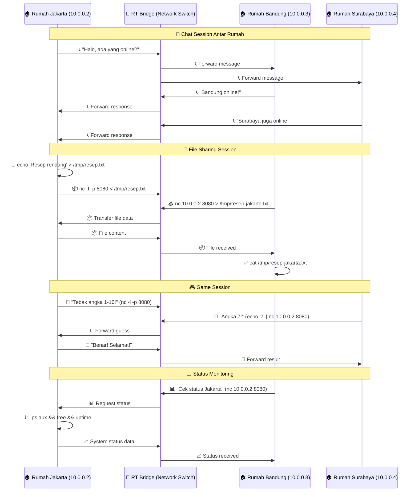
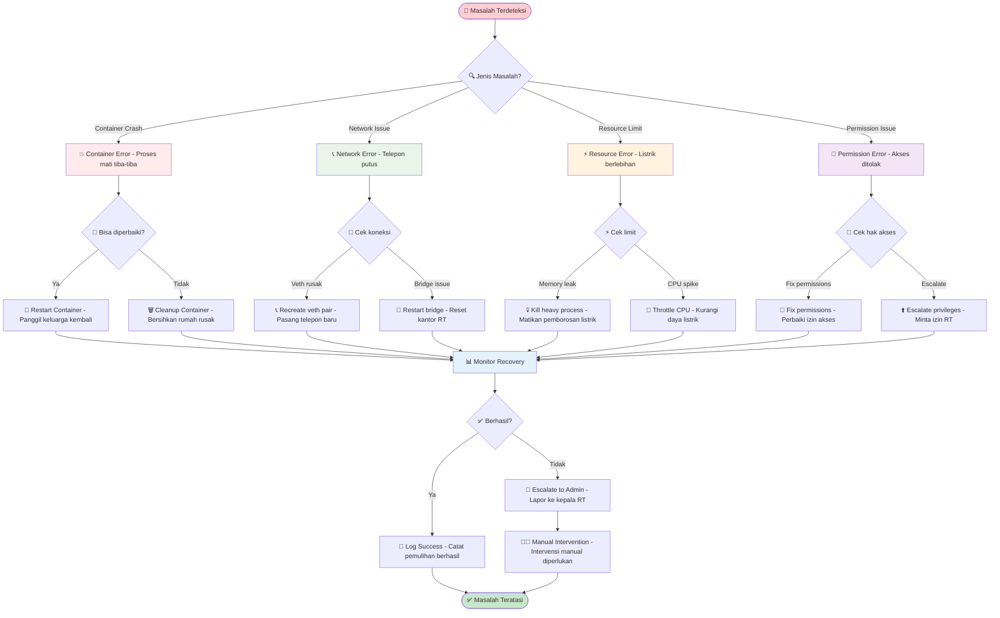

# 📊 RT Container Runtime - Diagram Mermaid

Kumpulan diagram untuk memahami konsep container technology melalui analogi RT dan perumahan.

## 📝 Catatan Terminologi

**Container vs Namespace:**
- **Container** = Kombinasi dari multiple Linux namespaces + cgroups + rootfs
- **Namespace** = Fitur isolasi spesifik Linux (PID, Network, Mount, dll)
- Dalam analogi: **Rumah** = Container, **Fasilitas Rumah** = Namespaces

Jadi satu "rumah" (container) memiliki berbagai "fasilitas" (namespaces) seperti sistem penomoran keluarga (PID), telepon (Network), rak buku (Mount), dll.

## 🏘️ 1. Struktur Kompleks Perumahan (System Overview)

## 👨‍👩‍👧‍👦 2. Struktur Keluarga dalam Container (Process Hierarchy)

## 🔒 3. Linux Namespaces sebagai Fasilitas Rumah

## ⚡ 4. Cgroups sebagai Sistem Listrik dan Air

## 📞 5. Container Networking sebagai Sistem Telepon

## 🔄 6. Container Lifecycle sebagai Siklus Hidup Rumah

```mermaid
stateDiagram-v2
    [*] --> Planning: RT merencanakan rumah baru
    
    Planning --> Creating: ./rt.sh create
    state Creating {
        [*] --> ValidateInput: Validasi nama & resource
        ValidateInput --> CreateDir: Buat direktori rumah
        CreateDir --> SetupRootfs: Setup struktur rumah
        SetupRootfs --> SetupBusybox: Install peralatan dasar
        SetupBusybox --> CreateConfig: Buat sertifikat rumah
        CreateConfig --> SetupCgroups: Pasang meteran listrik
        SetupCgroups --> AllocateIP: Daftar nomor telepon
        AllocateIP --> [*]
    }
    
    Creating --> Stopped: Rumah siap ditempati
    
    Stopped --> Running: ./rt.sh run
    state Running {
        [*] --> SetupNamespaces: Setup fasilitas rumah
        SetupNamespaces --> StartInit: Panggil kepala keluarga (PID 1)
        StartInit --> ActivateNetwork: Aktifkan telepon
        ActivateNetwork --> ApplyCgroups: Nyalakan listrik
        ApplyCgroups --> ExecuteCommand: Jalankan aktivitas
        ExecuteCommand --> [*]
    }
    
    Running --> Stopped: Proses selesai/exit
    Running --> Error: Masalah dalam rumah
    
    Error --> Recovery: ./rt.sh recover-state
    state Recovery {
        [*] --> DiagnoseIssue: Diagnosa masalah
        DiagnoseIssue --> CleanupOrphans: Bersihkan sisa-sisa
        CleanupOrphans --> RepairState: Perbaiki kondisi
        RepairState --> [*]
    }
    
    Recovery --> Stopped: Pemulihan berhasil
    Recovery --> Deleting: Tidak bisa diperbaiki
    
    Stopped --> Deleting: ./rt.sh delete
    state Deleting {
        [*] --> StopProcesses: Evakuasi penghuni
        StopProcesses --> CleanupNetwork: Cabut telepon
        CleanupNetwork --> CleanupCgroups: Matikan listrik
        CleanupCgroups --> RemoveRootfs: Robohkan struktur
        RemoveRootfs --> RemoveConfig: Hapus sertifikat
        RemoveConfig --> [*]
    }
    
    Deleting --> [*]: Rumah berhasil dihapus
    
    Error --> Deleting: Force delete
    
    note right of Planning
        🏠 Seperti RT yang merencanakan
        pembangunan rumah baru dengan
        alokasi listrik dan telepon
    end note
    
    note right of Running
        👨‍👩‍👧‍👦 Rumah ditempati keluarga
        dengan semua fasilitas aktif
    end note
    
    note right of Deleting
        🏗️ RT menghapus rumah dan
        membersihkan semua fasilitas
        dengan tertib
    end note
```

## 💬 7. Container Communication sebagai Chat Antar Rumah

## 🚨 8. Error Handling sebagai Sistem Darurat RT

---

## 📚 Cara Menggunakan Diagram

1. **Copy kode Mermaid** dari diagram yang ingin ditampilkan
2. **Paste ke editor** yang mendukung Mermaid (GitHub, GitLab, Notion, dll)
3. **Atau gunakan online editor** seperti [Mermaid Live Editor](https://mermaid.live/)

Diagram-diagram ini membantu memvisualisasikan konsep container technology dengan analogi RT dan perumahan yang familiar! 🏘️✨