# 📊 RT Container Runtime - Diagram Mermaid

Kumpulan diagram untuk memahami konsep container technology melalui analogi RT dan perumahan.

## 📝 Catatan Terminologi

**Container vs Namespace:**
- **Container** = Kombinasi dari multiple Linux namespaces + cgroups + rootfs
- **Namespace** = Fitur isolasi spesifik Linux (PID, Network, Mount, dll)
- Dalam analogi: **Rumah** = Container, **Fasilitas Rumah** = Namespaces

Jadi satu "rumah" (container) memiliki berbagai "fasilitas" (namespaces) seperti sistem penomoran keluarga (PID), telepon (Network), rak buku (Mount), dll.

## 🏘️ 1. Struktur Kompleks Perumahan (System Overview)

```mermaid
graph TB
    subgraph "🏘️ Kompleks Perumahan Linux Kernel"
        RT[🏢 Kantor RT - Container Runtime]
        RW[🏛️ Kantor RW - Host Network]
        Satpam[🚪 Pos Satpam - Network Gateway]
        Listrik[💡 Gardu Listrik - Resource Manager]
        
        subgraph "Rumah-rumah (Namespaces)"
            RumahA[🏠 Rumah Jakarta - Namespace A - 10.0.0.2]
            RumahB[🏠 Rumah Bandung - Namespace B - 10.0.0.3]
            RumahC[🏠 Rumah Surabaya - Namespace C - 10.0.0.4]
        end
        
        RT --> RumahA
        RT --> RumahB  
        RT --> RumahC
        
        RW --> Satpam
        Listrik --> RumahA
        Listrik --> RumahB
        Listrik --> RumahC
        
        RumahA <--> RW
        RumahB <--> RW
        RumahC <--> RW
    end
    
    Internet[🌐 Internet]
    Satpam <--> Internet
    
    style RT fill:#e1f5fe
    style RW fill:#f3e5f5
    style Satpam fill:#e8f5e8
    style Listrik fill:#fff3e0
    style RumahA fill:#ffebee
    style RumahB fill:#e3f2fd
    style RumahC fill:#f1f8e9
```

## 👨‍👩‍👧‍👦 2. Struktur Keluarga dalam Container (Process Hierarchy)

```mermaid
graph TD
    subgraph "🏠 Rumah Jakarta (PID Namespace)"
        Ayah[👨 Ayah PID 1 - busybox init - Kepala Keluarga]
        Ibu[👩 Ibu PID 2 - /bin/sh - Pengelola Rumah]
        Kakak[👦 Kakak PID 3 - web server - Anak Pertama]
        Adik[👧 Adik PID 4 - log process - Anak Kedua]
        Anjing[🐕 Anjing PID 5 - monitoring daemon - Peliharaan]
        
        Ayah --> Ibu
        Ayah --> Kakak
        Ayah --> Adik
        Ayah --> Anjing
        
        Ibu --> Kakak
        Ibu --> Adik
    end
    
    subgraph "🏠 Rumah Bandung (PID Namespace)"
        Ayah2[👨 Ayah PID 1 - busybox init - Kepala Keluarga]
        Ibu2[👩 Ibu PID 2 - /bin/sh - Pengelola Rumah]
        Anak2[👧 Anak PID 3 - database - Anak Tunggal]
        
        Ayah2 --> Ibu2
        Ayah2 --> Anak2
        Ibu2 --> Anak2
    end
    
    Note[📝 Catatan: Setiap rumah punya penomoran sendiri, Ayah PID 1 selalu nomor 1, Jika Ayah pergi keluarga pindah]
    
    style Ayah fill:#ffcdd2
    style Ayah2 fill:#ffcdd2
    style Ibu fill:#f8bbd9
    style Ibu2 fill:#f8bbd9
    style Note fill:#fff9c4
```

## 🔒 3. Linux Namespaces sebagai Fasilitas Rumah

```mermaid
graph LR
    subgraph "🏠 Rumah Jakarta"
        subgraph "Fasilitas Isolasi"
            PID[🔢 PID Namespace - Sistem Penomoran Keluarga - PID 1,2,3]
            NET[📞 Network Namespace - Telepon Rumah - 10.0.0.2/24]
            MNT[📚 Mount Namespace - Rak Buku & Lemari - /home,/var,/tmp]
            UTS[🏠 UTS Namespace - Nama Rumah - hostname jakarta]
            IPC[📝 IPC Namespace - Papan Tulis Keluarga - Message Queue]
            USER[👤 User Namespace - Identitas Keluarga - UID/GID mapping]
        end
    end
    
    subgraph "🏠 Rumah Bandung"
        subgraph "Fasilitas Isolasi"
            PID2[🔢 PID Namespace - Sistem Penomoran Keluarga - PID 1,2,3]
            NET2[📞 Network Namespace - Telepon Rumah - 10.0.0.3/24]
            MNT2[📚 Mount Namespace - Rak Buku & Lemari - /home,/var,/tmp]
            UTS2[🏠 UTS Namespace - Nama Rumah - hostname bandung]
            IPC2[📝 IPC Namespace - Papan Tulis Keluarga - Message Queue]
            USER2[👤 User Namespace - Identitas Keluarga - UID/GID mapping]
        end
    end
    
    PID -.-> PID2
    NET -.-> NET2
    MNT -.-> MNT2
    UTS -.-> UTS2
    IPC -.-> IPC2
    USER -.-> USER2
    
    style PID fill:#e3f2fd
    style NET fill:#e8f5e8
    style MNT fill:#fff3e0
    style UTS fill:#f3e5f5
    style IPC fill:#ffebee
    style USER fill:#f1f8e9
```

## ⚡ 4. Cgroups sebagai Sistem Listrik dan Air

```mermaid
graph TD
    subgraph "💡 Gardu Listrik Kompleks (Cgroup Manager)"
        Monitor[📊 Meteran Digital - Resource Monitor]
        
        subgraph "Pembagian Utilitas"
            MemCtrl[🧠 Memory Controller - Kuota RAM]
            CPUCtrl[⚡ CPU Controller - Kuota Processor]
            IOCtrl[💾 I/O Controller - Kuota Disk]
            NetCtrl[📡 Network Controller - Kuota Bandwidth]
        end
    end
    
    subgraph "Alokasi per Rumah"
        RumahA_Res[🏠 Rumah Jakarta - 512MB RAM, 50% CPU, 100MB/s I/O]
        RumahB_Res[🏠 Rumah Bandung - 256MB RAM, 25% CPU, 50MB/s I/O]
        RumahC_Res[🏠 Rumah Surabaya - 1GB RAM, 75% CPU, 200MB/s I/O]
    end
    
    Monitor --> MemCtrl
    Monitor --> CPUCtrl
    Monitor --> IOCtrl
    Monitor --> NetCtrl
    
    MemCtrl --> RumahA_Res
    MemCtrl --> RumahB_Res
    MemCtrl --> RumahC_Res
    
    CPUCtrl --> RumahA_Res
    CPUCtrl --> RumahB_Res
    CPUCtrl --> RumahC_Res
    
    IOCtrl --> RumahA_Res
    IOCtrl --> RumahB_Res
    IOCtrl --> RumahC_Res
    
    subgraph "Status Pemakaian"
        Status[📈 Real-time Usage - Jakarta 128MB/512MB, Bandung 64MB/256MB, Surabaya 512MB/1GB]
    end
    
    Monitor --> Status
    
    style Monitor fill:#fff3e0
    style MemCtrl fill:#e3f2fd
    style CPUCtrl fill:#e8f5e8
    style IOCtrl fill:#f3e5f5
    style NetCtrl fill:#ffebee
    style Status fill:#f1f8e9
```

## 📞 5. Container Networking sebagai Sistem Telepon

```mermaid
graph TB
    subgraph "🏘️ Sistem Telepon Kompleks"
        subgraph "🏠 Rumah Jakarta (10.0.0.2)"
            TelJkt[📞 veth-jakarta - Interface dalam rumah]
        end
        
        subgraph "🏠 Rumah Bandung (10.0.0.3)"
            TelBdg[📞 veth-bandung - Interface dalam rumah]
        end
        
        subgraph "🏠 Rumah Surabaya (10.0.0.4)"
            TelSby[📞 veth-surabaya - Interface dalam rumah]
        end
        
        subgraph "🏢 Kantor RT (Bridge/Switch)"
            Switch[🔌 Network Bridge - docker0 / rt-bridge]
            HostJkt[📞 veth-jakarta-host]
            HostBdg[📞 veth-bandung-host]
            HostSby[📞 veth-surabaya-host]
        end
        
        subgraph "🏛️ Kantor RW (Host Network)"
            HostNet[🌐 Host Interface - eth0]
        end
        
        subgraph "🚪 Pos Satpam (Gateway)"
            Gateway[🚪 Network Gateway - NAT/Routing]
        end
    end
    
    Internet[🌐 Internet]
    
    TelJkt -.->|Kabel Telepon veth pair| HostJkt
    TelBdg -.->|Kabel Telepon veth pair| HostBdg
    TelSby -.->|Kabel Telepon veth pair| HostSby
    
    HostJkt --> Switch
    HostBdg --> Switch
    HostSby --> Switch
    
    Switch --> HostNet
    HostNet --> Gateway
    Gateway <--> Internet
    
    TelJkt <-.->|Direct Call 10.0.0.2 to 10.0.0.3| TelBdg
    TelBdg <-.->|Direct Call 10.0.0.3 to 10.0.0.4| TelSby
    TelSby <-.->|Direct Call 10.0.0.4 to 10.0.0.2| TelJkt
    
    style Switch fill:#e3f2fd
    style HostNet fill:#f3e5f5
    style Gateway fill:#e8f5e8
    style TelJkt fill:#ffebee
    style TelBdg fill:#e3f2fd
    style TelSby fill:#f1f8e9
```

## 🔄 6. Container Lifecycle sebagai Siklus Hidup Rumah

```mermaid
stateDiagram-v2
    [*] --> Planning: RT merencanakan rumah baru
    
    Planning --> Creating: ./rt.sh create-container
    state Creating {
        [*] --> ValidateInput: Validasi nama & resource
        ValidateInput --> CreateDir: Buat direktori rumah
        CreateDir --> SetupRootfs: Setup struktur rumah
        SetupRootfs --> SetupBusybox: Install peralatan dasar
        SetupBusybox --> CreateConfig: Buat sertifikat rumah
        CreateConfig --> SetupCgroups: Pasang meteran listrik
        SetupCgroups --> AllocateIP: Daftar nomor telepon
        AllocateIP --> [*]
    }
    
    Creating --> Stopped: Rumah siap ditempati
    
    Stopped --> Running: ./rt.sh run-container
    state Running {
        [*] --> SetupNamespaces: Setup fasilitas rumah
        SetupNamespaces --> StartInit: Panggil kepala keluarga (PID 1)
        StartInit --> ActivateNetwork: Aktifkan telepon
        ActivateNetwork --> ApplyCgroups: Nyalakan listrik
        ApplyCgroups --> ExecuteCommand: Jalankan aktivitas
        ExecuteCommand --> [*]
    }
    
    Running --> Stopped: Proses selesai/exit
    Running --> Error: Masalah dalam rumah
    
    Error --> Recovery: ./rt.sh recover-state
    state Recovery {
        [*] --> DiagnoseIssue: Diagnosa masalah
        DiagnoseIssue --> CleanupOrphans: Bersihkan sisa-sisa
        CleanupOrphans --> RepairState: Perbaiki kondisi
        RepairState --> [*]
    }
    
    Recovery --> Stopped: Pemulihan berhasil
    Recovery --> Deleting: Tidak bisa diperbaiki
    
    Stopped --> Deleting: ./rt.sh delete-container
    state Deleting {
        [*] --> StopProcesses: Evakuasi penghuni
        StopProcesses --> CleanupNetwork: Cabut telepon
        CleanupNetwork --> CleanupCgroups: Matikan listrik
        CleanupCgroups --> RemoveRootfs: Robohkan struktur
        RemoveRootfs --> RemoveConfig: Hapus sertifikat
        RemoveConfig --> [*]
    }
    
    Deleting --> [*]: Rumah berhasil dihapus
    
    Error --> Deleting: Force delete
    
    note right of Planning
        🏠 Seperti RT yang merencanakan
        pembangunan rumah baru dengan
        alokasi listrik dan telepon
    end note
    
    note right of Running
        👨‍👩‍👧‍👦 Rumah ditempati keluarga
        dengan semua fasilitas aktif
    end note
    
    note right of Deleting
        🏗️ RT menghapus rumah dan
        membersihkan semua fasilitas
        dengan tertib
    end note
```

## 💬 7. Container Communication sebagai Chat Antar Rumah

```mermaid
sequenceDiagram
    participant Jakarta as 🏠 Rumah Jakarta (10.0.0.2)
    participant Bridge as 🏢 RT Bridge (Network Switch)
    participant Bandung as 🏠 Rumah Bandung (10.0.0.3)
    participant Surabaya as 🏠 Rumah Surabaya (10.0.0.4)
    
    Note over Jakarta, Surabaya: 💬 Chat Session Antar Rumah
    
    Jakarta->>Bridge: 📞 "Halo, ada yang online?"
    Bridge->>Bandung: 📞 Forward message
    Bridge->>Surabaya: 📞 Forward message
    
    Bandung->>Bridge: 📞 "Bandung online!"
    Bridge->>Jakarta: 📞 Forward response
    
    Surabaya->>Bridge: 📞 "Surabaya juga online!"
    Bridge->>Jakarta: 📞 Forward response
    
    Note over Jakarta, Surabaya: 📁 File Sharing Session
    
    Jakarta->>Jakarta: 📝 echo 'Resep rendang' > /tmp/resep.txt
    Jakarta->>Bridge: 📦 nc -l -p 8080 < /tmp/resep.txt
    
    Bandung->>Bridge: 📥 nc 10.0.0.2 8080 > /tmp/resep-jakarta.txt
    Bridge->>Jakarta: 📦 Transfer file data
    Jakarta->>Bridge: 📦 File content
    Bridge->>Bandung: 📦 File received
    
    Bandung->>Bandung: ✅ cat /tmp/resep-jakarta.txt
    
    Note over Jakarta, Surabaya: 🎮 Game Session
    
    Jakarta->>Bridge: 🎯 "Tebak angka 1-10!" (nc -l -p 8080)
    Surabaya->>Bridge: 🎲 "Angka 7!" (echo '7' | nc 10.0.0.2 8080)
    Bridge->>Jakarta: 🎲 Forward guess
    Jakarta->>Bridge: 🎉 "Benar! Selamat!"
    Bridge->>Surabaya: 🎉 Forward result
    
    Note over Jakarta, Surabaya: 📊 Status Monitoring
    
    Bandung->>Bridge: 📊 "Cek status Jakarta" (nc 10.0.0.2 8080)
    Bridge->>Jakarta: 📊 Request status
    Jakarta->>Jakarta: 📈 ps aux && free && uptime
    Jakarta->>Bridge: 📈 System status data
    Bridge->>Bandung: 📈 Status received
```

## 🚨 8. Error Handling sebagai Sistem Darurat RT

```mermaid
flowchart TD
    Start([🚨 Masalah Terdeteksi]) --> Detect{🔍 Jenis Masalah?}
    
    Detect -->|Container Crash| ContainerError[💥 Container Error - Proses mati tiba-tiba]
    Detect -->|Network Issue| NetworkError[📞 Network Error - Telepon putus]
    Detect -->|Resource Limit| ResourceError[⚡ Resource Error - Listrik berlebihan]
    Detect -->|Permission Issue| PermError[🔐 Permission Error - Akses ditolak]
    
    ContainerError --> ContainerRecovery{🔧 Bisa diperbaiki?}
    ContainerRecovery -->|Ya| RestartContainer[🔄 Restart Container - Panggil keluarga kembali]
    ContainerRecovery -->|Tidak| CleanupContainer[🗑️ Cleanup Container - Bersihkan rumah rusak]
    
    NetworkError --> NetworkRecovery{🔧 Cek koneksi}
    NetworkRecovery -->|Veth rusak| RecreateVeth[📞 Recreate veth pair - Pasang telepon baru]
    NetworkRecovery -->|Bridge issue| RestartBridge[🏢 Restart bridge - Reset kantor RT]
    
    ResourceError --> ResourceRecovery{⚡ Cek limit}
    ResourceRecovery -->|Memory leak| KillProcess[💀 Kill heavy process - Matikan pemborosan listrik]
    ResourceRecovery -->|CPU spike| ThrottleCPU[🐌 Throttle CPU - Kurangi daya listrik]
    
    PermError --> PermRecovery{🔐 Cek hak akses}
    PermRecovery -->|Fix permissions| FixPerm[🔧 Fix permissions - Perbaiki izin akses]
    PermRecovery -->|Escalate| EscalatePriv[⬆️ Escalate privileges - Minta izin RT]
    
    RestartContainer --> Monitor[📊 Monitor Recovery]
    CleanupContainer --> Monitor
    RecreateVeth --> Monitor
    RestartBridge --> Monitor
    KillProcess --> Monitor
    ThrottleCPU --> Monitor
    FixPerm --> Monitor
    EscalatePriv --> Monitor
    
    Monitor --> Success{✅ Berhasil?}
    Success -->|Ya| LogSuccess[📝 Log Success - Catat pemulihan berhasil]
    Success -->|Tidak| Escalate[🚨 Escalate to Admin - Lapor ke kepala RT]
    
    LogSuccess --> End([✅ Masalah Teratasi])
    Escalate --> ManualIntervention[👨‍💼 Manual Intervention - Intervensi manual diperlukan]
    ManualIntervention --> End
    
    style Start fill:#ffcdd2
    style ContainerError fill:#ffebee
    style NetworkError fill:#e8f5e8
    style ResourceError fill:#fff3e0
    style PermError fill:#f3e5f5
    style Monitor fill:#e3f2fd
    style End fill:#c8e6c9
```

---

## 📚 Cara Menggunakan Diagram

1. **Copy kode Mermaid** dari diagram yang ingin ditampilkan
2. **Paste ke editor** yang mendukung Mermaid (GitHub, GitLab, Notion, dll)
3. **Atau gunakan online editor** seperti [Mermaid Live Editor](https://mermaid.live/)

Diagram-diagram ini membantu memvisualisasikan konsep container technology dengan analogi RT dan perumahan yang familiar! 🏘️✨